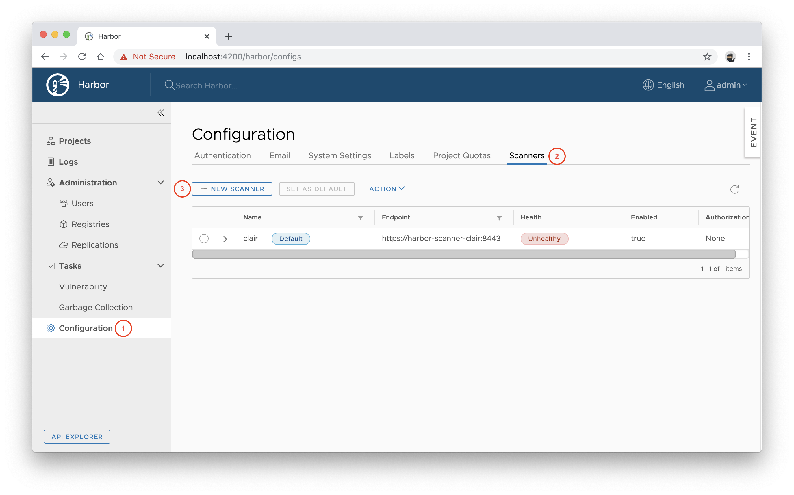
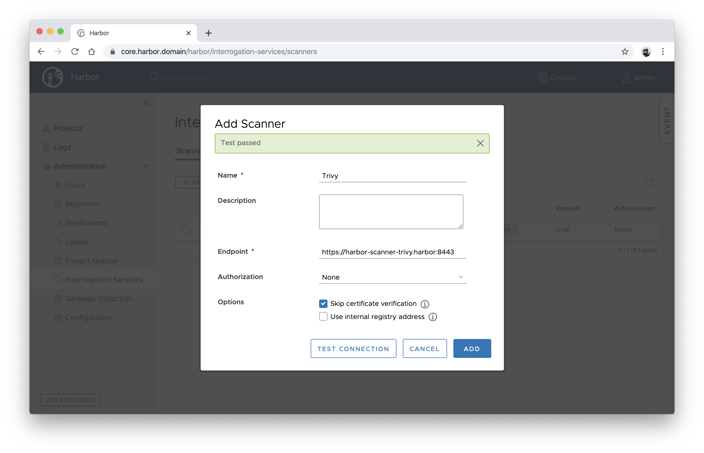
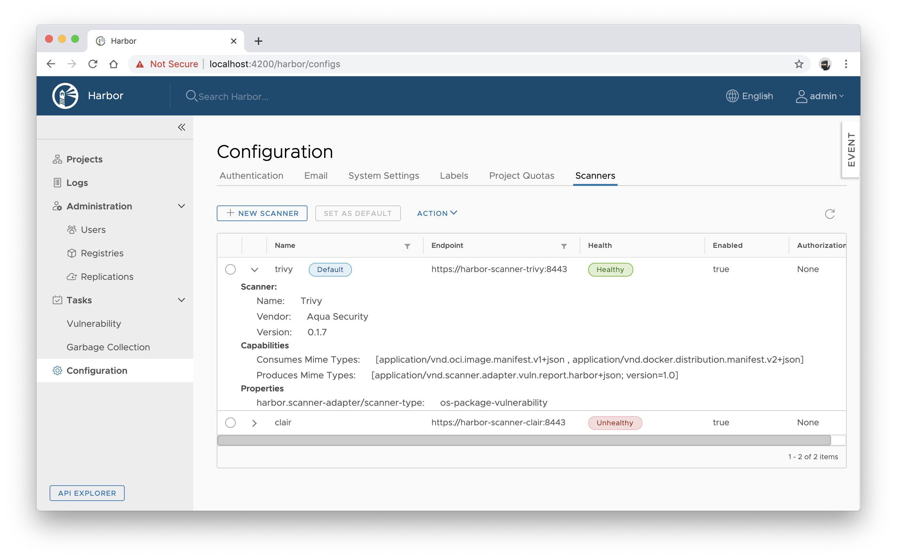

[![GitHub release][release-img]][release]
[![Build Status][ci-img]][ci]
[![Coverage Status][cov-img]][cov]
[![Go Report Card][report-card-img]][report-card]
[![License][license-img]][license]

# Harbor Scanner Adapter for Trivy

The Harbor [Scanner Adapter][image-vulnerability-scanning-proposal] for [Trivy][trivy-url] is a service that translates
the [Harbor][harbor-url] scanning API into Trivy commands and allows Harbor to use Trivy for providing vulnerability
reports on images stored in Harbor registry as part of its vulnerability scan feature.

## TOC

- [Getting started](#getting-started)
  - [Prerequisites](#prerequisites)
  - [Build](#build)
  - [Running on minikube](#running-on-minikube)
- [Testing](#testing)
  - [Unit testing](#unit-testing)
  - [Integration testing](#integration-testing)
  - [Component testing](#component-testing)
- [Deployment](#deployment)
  - [Kubernetes](#kubernetes)
- [Configuration](#configuration)
- [Documentation](#documentation)
- [Contributing](#contributing)
- [License](#license)

## Getting started

These instructions will get you a copy of the adapter service up and running on your local machine for development
and testing purposes. See [deployment](#deployment) for notes on how to deploy on a live system.

### Prerequisites

* [Go (version 1.13)](https://golang.org/doc/devel/release.html#go1.13)
* Docker

### Build

Run `make` to build the binary in `./scanner-trivy`:

```
make
```

To build into a Docker container:

```
make container
```

### Running on [minikube][minikube-url]

1. Set up environment for the Docker client:
   ```
   $ eval $(minikube docker-env)
   ```
2. Build a Docker image `aquasec/harbor-scanner-trivy:dev`:
   ```
   $ make container
   ```
3. Install the `harbor-scanner-trivy` release with `helm`:
   ```
   $ helm install harbor-scanner-trivy ./helm/harbor-scanner-trivy \
                  --set scanner.logLevel=trace \
                  --set image.tag=dev
   ```

## Testing

Unit testing alone doesn't provide guarantees about the behaviour of the adapter. To verify that each Go module
correctly interacts with its collaborators, more coarse grained testing is required as described in
[Testing Strategies in a Microservice Architecture][fowler-testing-strategies].

### Unit testing

Run `make test` to run all unit tests:

```
make test
```

### Integration testing

Run `make test-integration` to run integration tests:

```
make test-integration
```

### Component testing

Running out of process component tests is not fully automated yet (see [#38][issue-38]). However, you can run them
as follows:

```
docker-compose -f test/component/docker-compose.yaml up -d
make test-component
docker-compose -f test/component/docker-compose.yaml down
```

## Deployment

### Kubernetes

1. Generate certificate and private key files:
   ```
   $ openssl genrsa -out tls.key 2048
   $ openssl req -new -x509 \
                 -key tls.key \
                 -out tls.crt \
                 -days 365 \
                 -subj /CN=harbor-scanner-trivy.harbor
   ```
2. Install the `harbor-scanner-trivy` chart:
   ```
   $ helm install harbor-scanner-trivy ./helm/harbor-scanner-trivy \
                  --namespace harbor \
                  --set service.port=8443 \
                  --set scanner.api.tlsEnabled=true \
                  --set scanner.api.tlsCertificate="`cat tls.crt`" \
                  --set scanner.api.tlsKey="`cat tls.key`"
   ```
3. Configure the scanner adapter in Harbor web console.
   1. Navigate to **Interrogation Services** and click **+ NEW SCANNER**.
      
   2. Enter https://harbor-scanner-trivy.harbor:8443 as the **Endpoint** URL and click **TEST CONNECTION**.
      
   3. If everything is fine click **ADD** to save the configuration.
4. Select the **Trivy** scanner and set it as default by clicking **SET AS DEFAULT**.
   
   Make sure that the **Default** label is displayed next to the **Trivy** scanner's name.

## Configuration

Configuration of the adapter is done via environment variables at startup.

|                  Name                     |                  Default           | Description |
|-------------------------------------------|------------------------------------|-------------|
| `SCANNER_LOG_LEVEL`                       | `info`                             | The log level of `trace`, `debug`, `info`, `warn`, `warning`, `error`, `fatal` or `panic`. The standard logger logs entries with that level or anything above it. |
| `SCANNER_API_SERVER_ADDR`                 | `:8080`                            | Binding address for the API server                                                   |
| `SCANNER_API_SERVER_TLS_CERTIFICATE`      | N/A                                | The absolute path to the x509 certificate file                                       |
| `SCANNER_API_SERVER_TLS_KEY`              | N/A                                | The absolute path to the x509 private key file                                       |
| `SCANNER_API_SERVER_READ_TIMEOUT`         | `15s`                              | The maximum duration for reading the entire request, including the body              |
| `SCANNER_API_SERVER_WRITE_TIMEOUT`        | `15s`                              | The maximum duration before timing out writes of the response                        |
| `SCANNER_API_SERVER_IDLE_TIMEOUT`         | `60s`                              | The maximum amount of time to wait for the next request when keep-alives are enabled |
| `SCANNER_TRIVY_CACHE_DIR`                 | `/home/scanner/.cache/trivy`       | Trivy cache directory                                                                |
| `SCANNER_TRIVY_REPORTS_DIR`               | `/home/scanner/.cache/reports`     | Trivy reports directory                                                              |
| `SCANNER_TRIVY_DEBUG_MODE`                | `false`                            | The flag to enable or disable Trivy debug mode                                       |
| `SCANNER_TRIVY_VULN_TYPE`                 | `os`                               | Comma-separated list of vulnerability types. Possible values `os` and `library`      |
| `SCANNER_TRIVY_SEVERITY`                  | `UNKNOWN,LOW,MEDIUM,HIGH,CRITICAL` | Comma-separated list of vulnerabilities severities to be displayed                   |
| `SCANNER_TRIVY_IGNORE_UNFIXED`            | `false`                            | The flag to display only fixed vulnerabilities                                       |
| `SCANNER_STORE_REDIS_URL`                 | `redis://harbor-harbor-redis:6379` | Redis server URI for a redis store                                                   |
| `SCANNER_STORE_REDIS_NAMESPACE`           | `harbor.scanner.trivy:store`       | A namespace for keys in a redis store                                                |
| `SCANNER_STORE_REDIS_POOL_MAX_ACTIVE`     | `5`                                | The max number of connections allocated by the pool for a redis store                |
| `SCANNER_STORE_REDIS_POOL_MAX_IDLE`       | `5`                                | The max number of idle connections in the pool for a redis store                     |
| `SCANNER_STORE_REDIS_SCAN_JOB_TTL`        | `1h`                               | The time to live for persisting scan jobs and associated scan reports                |
| `SCANNER_JOB_QUEUE_REDIS_URL`             | `redis://harbor-harbor-redis:6379` | Redis server URI for a jobs queue                                                    |
| `SCANNER_JOB_QUEUE_REDIS_NAMESPACE`       | `harbor.scanner.trivy:job-queue`   | A namespace for keys in a jobs queue                                                 |
| `SCANNER_JOB_QUEUE_REDIS_POOL_MAX_ACTIVE` | `5`                                | The max number of connections allocated by the pool for a jobs queue                 |
| `SCANNER_JOB_QUEUE_REDIS_POOL_MAX_IDLE`   | `5`                                | The max number of idle connections in the pool for a jobs queue                      |
| `SCANNER_JOB_QUEUE_WORKER_CONCURRENCY`    | `1`                                | The number of workers to spin-up for a jobs queue                                    |

## Documentation

- [Architecture](./docs/ARCHITECTURE.md): architectural decisions behind designing harbor-scanner-trivy.
- [Releases](./docs/RELEASES.md): how to release a new version of harbor-scanner-trivy.

## Contributing

Please read [CODE_OF_CONDUCT.md][coc-url] for details on our code of conduct, and the process for submitting pull
requests.

## License

This project is licensed under the Apache 2.0 license - see the [LICENSE](LICENSE) file for details.

[release-img]: https://img.shields.io/github/release/aquasecurity/harbor-scanner-trivy.svg
[release]: https://github.com/aquasecurity/harbor-scanner-trivy/releases
[ci-img]: https://travis-ci.org/aquasecurity/harbor-scanner-trivy.svg?branch=master
[ci]: https://travis-ci.org/aquasecurity/harbor-scanner-trivy
[cov-img]: https://codecov.io/github/aquasecurity/harbor-scanner-trivy/branch/master/graph/badge.svg
[cov]: https://codecov.io/github/aquasecurity/harbor-scanner-trivy
[report-card-img]: https://goreportcard.com/badge/github.com/aquasecurity/harbor-scanner-trivy
[report-card]: https://goreportcard.com/report/github.com/aquasecurity/harbor-scanner-trivy
[license-img]: https://img.shields.io/github/license/aquasecurity/harbor-scanner-trivy.svg
[license]: https://github.com/aquasecurity/harbor-scanner-trivy/blob/master/LICENSE

[minikube-url]: https://github.com/kubernetes/minikube
[harbor-url]: https://github.com/goharbor/harbor
[trivy-url]: https://github.com/aquasecurity/trivy
[latest-release-url]: https://hub.docker.com/r/aquasec/harbor-scanner-trivy/tags
[image-vulnerability-scanning-proposal]: https://github.com/goharbor/community/blob/master/proposals/pluggable-image-vulnerability-scanning_proposal.md
[coc-url]: https://github.com/aquasecurity/.github/blob/master/CODE_OF_CONDUCT.md
[fowler-testing-strategies]: https://www.martinfowler.com/articles/microservice-testing/
[issue-38]: https://github.com/aquasecurity/harbor-scanner-trivy/issues/38
